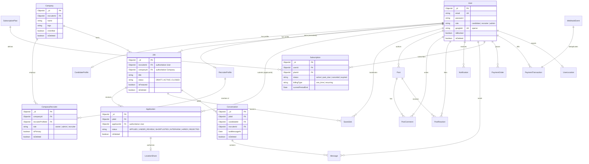
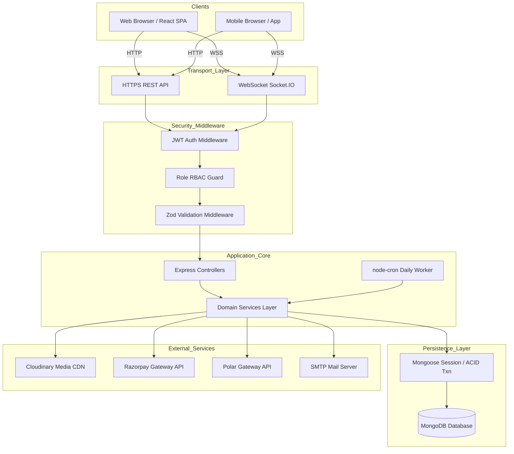

# JobBox Backend — System Architecture

**Document Version:** 1.0.0  
**Classification:** Technical System Design & Architecture Specification  
**Target Environment:** Node.js (TypeScript) / Express 5 / MongoDB (Mongoose ODM)

---

## 1. System Overview

JobBox is an enterprise job-portal and professional networking backend architected as a modular monolith. The system handles job posting, candidate discovery, application state machines, multi-party company recruiter authorization, threaded community discussions, real-time WebSocket chat, GPS location sharing, multi-provider subscription billing, and administrative governance.

### Core Processing Flow
```
Client (Web / Mobile)
   ├── REST HTTPS Requests ─────────────┐
   └── WSS WebSocket Handshake ─────────┤
                                        ▼
                           ┌────────────────────────┐
                           │   Express 5 Pipeline   │
                           │  - CORS & Rate Limiting│
                           │  - Auth JWT Middleware │
                           │  - Zod Validation      │
                           │  - Controller Layer    │
                           │  - Domain Services     │
                           └───────────┬────────────┘
                                       │
                      ┌────────────────┴────────────────┐
                      ▼                                 ▼
         ┌─────────────────────────┐       ┌─────────────────────────┐
         │ MongoDB (Mongoose ODM)  │       │  External Integrations  │
         │ - 20 Core Collections   │       │  - Cloudinary (Media)   │
         │ - ACID Transactions     │       │  - Razorpay (INR Pay)   │
         │ - Partial Unique Indexes│       │  - Polar (USD / Global) │
         └─────────────────────────┘       │  - Nodemailer (SMTP)    │
                                           │  - node-cron (Workers)  │
                                           └─────────────────────────┘
```

### External Integrations
- **Cloudinary:** Cloud asset storage for candidate resumes (PDF/DOCX), profile avatars, company logos, and social feed media uploads with server-side validation and rollback deletion on database failure.
- **Razorpay:** Domestic Indian Rupee (INR) payment processing using server-side HMAC-SHA256 signature verification, pre-order persistence, and webhook event capture.
- **Polar:** Global USD subscription gateway supporting recurring plans, dynamic product catalog provisioning, and webhook event deduplication.
- **Nodemailer:** Asynchronous SMTP email delivery with HTML template rendering for application updates, interview invites, offline chat alerts, and subscription renewal notices.
- **node-cron:** In-process deterministic cron workers executing daily subscription auto-expiration, 3-day renewal alerts, and offline chat message debounced email digests.

---

## 2. Architectural Style

### Modular Monolith & Layered Boundaries
The backend is structured into clear architectural tiers to maintain strict separation of concerns, high testability, and deterministic business logic isolation:

```
src/
├── config/       # Environment, Database, Socket.IO, and Gateway Initialization
├── constants/    # Enums, Status Codes, Role Definitions, and System Thresholds
├── controllers/  # Thin HTTP Transport Handlers & Param Parsing
├── jobs/         # node-cron Background Scheduled Workers
├── middleware/   # JWT Auth, Role RBAC, Zod Validation, Global Error Handling
├── models/       # Mongoose Schemas, Index Configurations, and Virtual Transforms
├── routes/       # Endpoint Declarations & Middleware Pipeline Chaining
├── services/     # Pure Domain Logic, Multi-Collection Transactions, External APIs
├── utils/        # Cryptography, JWT, Pagination Arithmetic, AppError Class
└── validations/  # Zod Schema Request Contracts (Body, Query, Params)
```

### Key Architectural Tenets
1. **Business Logic Lives in Services:** Controllers never execute database queries directly or perform business calculations. All mutations, status validations, and orchestration reside in dedicated service functions.
2. **Controllers Remain Thin:** Controllers strictly unpack incoming requests (`req.params`, `req.query`, `req.body`), pass strongly-typed arguments to domain services, and return uniform JSON payloads via `asyncHandler`.
3. **Lean Models:** Models define schemas, field data types, compound indexes, and JSON transforms. They do not house multi-collection side effects or implicit persistence triggers.
4. **Explicit Boundaries:** Modules communicate through public service functions and database models, using dynamic ESM imports where circular dependencies could otherwise emerge.

---

## 3. Backend Module Architecture

| Module | Core Responsibility | Key Models | Key Services | Primary Authorization Rules |
| :--- | :--- | :--- | :--- | :--- |
| **Authentication** | Registration, credential hashing, login, JWT issuance, Google SSO, token refresh. | `User` | `auth.service.ts` | Public routes for login/register; valid Bearer token required for refresh/logout. |
| **User & Profile** | Candidate/Recruiter profile management, resume attachments, bio, social links. | `User`, `CandidateProfile`, `RecruiterProfile` | `profile.service.ts` | Users can only modify their own profile; public profile endpoints enforce data redaction. |
| **Company** | Company profile, verification status, website, industry, and branding. | `Company` | `company.service.ts` | Company updates restricted to primary owners and authorized `CompanyRecruiter` members. |
| **CompanyRecruiter** | Multi-recruiter team membership, ownership transfer, and teammate access. | `CompanyRecruiter` | `company.service.ts` | Only primary owners can invite/remove teammates or transfer ownership. |
| **Jobs** | Job lifecycle management (Draft $\rightarrow$ Active $\rightarrow$ Closed), faceted search. | `Job`, `Company`, `RecruiterProfile` | `job.service.ts` | Candidates/public view active jobs; job owners, teammates, and admins view draft/closed jobs. |
| **Applications** | Application state machine, resume submission, interview scheduling, withdrawal. | `Application`, `Job`, `CandidateProfile` | `application.service.ts` | Candidates manage own applications; job owners and authorized company teammates manage candidate pipelines. |
| **Saved Jobs** | Candidate bookmark management. | `SavedJob`, `Job` | `saved-job.service.ts` | Restricted strictly to candidate role for active, non-deleted jobs. |
| **Posts** | Community social feed, rich text posts, media attachments. | `Post` | `post.service.ts` | Public feed readable by all; mutations restricted to post author. |
| **Comments & Replies** | Threaded single-level comments on community posts. | `PostComment`, `Post` | `post-comment.service.ts` | Authenticated users can comment/reply; deletions restricted to comment author or post author. |
| **Reactions** | Idempotent post liking. | `PostReaction`, `Post` | `post-reaction.service.ts` | Authenticated users can toggle like; unique compound index prevents duplicate likes. |
| **Notifications** | In-app alerts, unread counts, Socket.IO dispatch, offline email trigger. | `Notification` | `notification.service.ts` | Users can only read, list, and mutate their own notifications. |
| **Chat** | Application-gated 1:1 messaging, typing status, presence tracking. | `Conversation`, `Message`, `Application` | `chat.service.ts`, `socket.ts` | Requires an active job application between candidate and recruiter; participants restricted to conversation parties. |
| **Location Sharing** | Real-time GPS sharing between applicant and recruiter. | `LocationShare`, `UserLocation`, `LocationAccessLog` | `location.service.ts` | Candidate controls sharing toggle and privacy level (Approximate vs Precise). |
| **Payments & Subscriptions**| Gateway checkout, HMAC verification, webhook deduplication, subscription state. | `Subscription`, `SubscriptionPlan`, `PaymentOrder`, `PaymentTransaction`, `Coupon`, `WebhookEvent` | `subscription.service.ts`, `razorpay.service.ts`, `polar.service.ts`, `invoice.service.ts` | Users manage own billing and invoices; webhook endpoints verify cryptographic signatures. |
| **Admin** | User blocking, company verification, system KPI calculations, revenue analytics. | All Collections | `admin.service.ts` | Restricted strictly to `admin` role via `authorize("admin")`. |
| **Dashboard** | Candidate and Recruiter overview analytics and pipeline metric aggregations. | `Job`, `Application`, `Subscription` | `dashboard.service.ts` | Scoped strictly to authenticated user's ID and authorized company ID. |
| **Uploads** | Secure signed Cloudinary upload handling and resume access gate. | `CandidateProfile`, `Job`, `Application`, `CompanyRecruiter` | `upload.controller.ts`, `cloudinary.service.ts` | Validates file types, size limits, and verifies recruiter team authorization before generating resume URLs. |

---

## 4. Database Architecture & Relationships

### Collections Overview

```
User (1) ────────┬── (1) CandidateProfile
                 ├── (1) RecruiterProfile
                 ├── (N) CompanyRecruiter ── (1) Company
                 ├── (N) Job
                 ├── (N) Application
                 ├── (N) Subscription
                 ├── (N) Conversation
                 ├── (N) Post
                 └── (N) Notification
```

### Relationship Designations

| Relationship Reference | Cardinality | Authoritative Storage | Derived / Snapshot Field | Architectural Status |
| :--- | :--- | :--- | :--- | :--- |
| **Company Membership** | $N:1$ | `CompanyRecruiter.companyId` $\rightarrow$ `Company._id`<br>`CompanyRecruiter.recruiterProfileId` $\rightarrow$ `RecruiterProfile._id` | `RecruiterProfile.companyId` | **`CompanyRecruiter` is Authoritative.** `RecruiterProfile.companyId` is deprecated legacy. |
| **Job Ownership** | $N:1$ | `Job.recruiterId` $\rightarrow$ `User._id` | `Job.postedBy` | **`Job.recruiterId` (User) is Authoritative.** `Job.postedBy` is deprecated legacy. |
| **Job Organization** | $N:1$ | `Job.companyId` $\rightarrow$ `Company._id` | `Job.company` | **`Job.companyId` is Authoritative.** `Job.company` is a denormalized string snapshot. |
| **Job Application** | $N:1$ | `Application.jobId` $\rightarrow$ `Job._id`<br>`Application.applicantId` $\rightarrow$ `User._id` | `Application.candidateProfileId` | **`Application.applicantId` (User) is Authoritative.** Profile ID kept for fast profile joins. |
| **Chat Participants** | $1:1$ | `Conversation.candidateId` $\rightarrow$ `User._id`<br>`Conversation.recruiterId` $\rightarrow$ `User._id`<br>`Conversation.jobId` $\rightarrow$ `Job._id` | None | **Canonical User Identities.** Direct `User._id` prevents profile identity fragmentation. |
| **Active Subscription** | $1:1$ | `Subscription.userId` $\rightarrow$ `User._id`<br>`Subscription.planId` $\rightarrow$ `SubscriptionPlan._id` | `Subscription.planCode` | Partial unique index `{ userId: 1 }` (`status: "active"`) enforces singleton active plan. |

---

## 5. Entity Relationship Diagram



---

## 6. Authorization Architecture

### Pipeline Execution Order
```
1. Incoming HTTP Request
      ↓
2. authMiddleware (Verifies Bearer JWT signature, decodes { userId, role }, attaches req.user)
      ↓
3. authorize("role") (Enforces coarse RBAC: candidate / recruiter / admin)
      ↓
4. validate(schema) (Enforces Zod schema on params, query, body)
      ↓
5. Domain Service Invocation
      ├── Resource Ownership Check (e.g., entity.userId === req.user.userId)
      ├── CompanyRecruiter Teammate Auth (getAuthorizedCompanyForRecruiter)
      └── Business State Validation (e.g., application status machine, non-deleted check)
```

### Role & Permission Matrix

| Operation / Endpoint | Candidate | Recruiter (Owner) | Recruiter (Teammate) | Platform Admin | Unauthenticated |
| :--- | :---: | :---: | :---: | :---: | :---: |
| **Browse Active Jobs** | ✅ Allowed | ✅ Allowed | ✅ Allowed | ✅ Allowed | ✅ Allowed |
| **View Draft / Closed Jobs** | ❌ Forbidden | ✅ (Own Jobs) | ✅ (Company Jobs) | ✅ (All Jobs) | ❌ Forbidden |
| **Create / Update Jobs** | ❌ Forbidden | ✅ Allowed | ✅ (Company Jobs) | ✅ Allowed | ❌ Forbidden |
| **Apply for Job** | ✅ Allowed | ❌ Forbidden | ❌ Forbidden | ❌ Forbidden | ❌ Forbidden |
| **View Job Applicants** | ❌ Forbidden | ✅ (Own Jobs) | ✅ (Company Jobs) | ✅ (All Jobs) | ❌ Forbidden |
| **Update Applicant Status**| ❌ Forbidden | ✅ (Own Jobs) | ✅ (Company Jobs) | ✅ Allowed | ❌ Forbidden |
| **Access Candidate Resume** | ✅ (Own Resume)| ✅ (Own Jobs) | ✅ (Company Jobs) | ✅ (All Jobs) | ❌ Forbidden |
| **Publish / Edit Post** | ✅ Allowed | ✅ Allowed | ✅ Allowed | ✅ Allowed | ❌ Forbidden |
| **Delete Post** | ✅ (Own Post) | ✅ (Own Post) | ✅ (Own Post) | ✅ (Any Post) | ❌ Forbidden |
| **Send Chat Message** | ✅ (If Applied) | ✅ (If Applied) | ❌ Forbidden | ❌ Forbidden | ❌ Forbidden |
| **Initiate Checkout** | ✅ Allowed | ✅ Allowed | ✅ Allowed | ✅ Allowed | ❌ Forbidden |
| **View Invoices** | ✅ (Own Txn) | ✅ (Own Txn) | ✅ (Own Txn) | ✅ (All Txns) | ❌ Forbidden |
| **Verify Companies** | ❌ Forbidden | ❌ Forbidden | ❌ Forbidden | ✅ Allowed | ❌ Forbidden |
| **Block / Unblock Users** | ❌ Forbidden | ❌ Forbidden | ❌ Forbidden | ✅ Allowed | ❌ Forbidden |

---

## 7. Job & Application Lifecycle

### Job State Machine
```
   ┌─────────┐
   │  DRAFT  │ ──(Publish)──► ┌──────────┐ ──(Close)──► ┌──────────┐
   └─────────┘                │  ACTIVE  │              │  CLOSED  │
        │                     └──────────┘              └──────────┘
        │ (Soft Delete)             │ (Soft Delete)           │ (Soft Delete)
        ▼                           ▼                         ▼
   ┌───────────────────────────────────────────────────────────────┐
   │                  isDeleted: true (Soft Deleted)               │
   └───────────────────────────────────────────────────────────────┘
```

### Application State Machine
```
   ┌───────────┐
   │  APPLIED  │ ──► ┌──────────────┐ ──► ┌─────────────┐ ──► ┌───────────┐ ──► ┌─────────┐
   └───────────┘     │ UNDER REVIEW │     │ SHORTLISTED │     │ INTERVIEW │     │  HIRED  │
         │           └──────────────┘     └─────────────┘     └───────────┘     └─────────┘
         │                  │                    │                  │
         └──────────────────┴────────────────────┴──────────────────┴─────────► ┌──────────┐
                                       (Reject from any prior step)              │ REJECTED │
                                                                                └──────────┘
```

### Lifecycle Rules & Invariants
1. **Forward-Only Progressions:** Regressive state transitions (e.g., `UNDER_REVIEW` $\rightarrow$ `APPLIED` or `HIRED` $\rightarrow$ `INTERVIEW`) are rejected with `400 Bad Request`.
2. **Terminal State Lock:** Once an application reaches `HIRED` or `REJECTED`, further status mutations are rejected with `409 Conflict`.
3. **Interview Validation:** Transitioning to `INTERVIEW` strictly requires valid interview details (`interviewDate` in the future, time string, and meeting URL).
4. **Duplicate Prevention:** Unique partial index `{ jobId: 1, applicantId: 1 }` (`isDeleted: false`) blocks concurrent double-applications.
5. **Withdrawal & Re-Application:** Withdrawn applications are soft-deleted (`isDeleted: true`). Candidates may cleanly re-apply later; the system revives the existing document back to `APPLIED` with `isDeleted: false`.

---

## 8. Company & Recruiter Membership

### Multi-Recruiter Authorization Topology
```
                  ┌──────────────────────┐
                  │    Company Model     │
                  └──────────┬───────────┘
                             │ (1:N)
                             ▼
              ┌───────────────────────────────┐
              │    CompanyRecruiter Model     │
              │  - role: "owner|admin|rec"    │
              │  - isPrimary: boolean         │
              │  - isDeleted: boolean         │
              └──────────────┬────────────────┘
                             │ (N:1)
                             ▼
                  ┌──────────────────────┐
                  │   RecruiterProfile   │
                  └──────────┬───────────┘
                             │ (1:1)
                             ▼
                  ┌──────────────────────┐
                  │      User Model      │
                  └──────────────────────┘
```

### Authorization Resolution Rules
- The canonical helper [`getAuthorizedCompanyForRecruiter(userId)`](file:///c:/Users/Surinder%20Singh/OneDrive/Desktop/Project%20X/job-portal/jobs-box/server/src/services/company.service.ts#L17-L62) resolves the user's `RecruiterProfile` and retrieves the active `CompanyRecruiter` document where `isDeleted: false`.
- **Primary Owner Guarantee:** Unique partial index `{ companyId: 1 }` (`partialFilterExpression: { isPrimary: true, isDeleted: false }`) guarantees at most one active primary owner per company.
- **Teammate Parity:** All active recruiters belonging to the company share access to company-scoped job listings, applicant pipelines, and applicant resumes.

---

## 9. Social System

### Threaded Tree Model
```
┌────────────────────────────────────────────────────────┐
│                       Post Model                       │
│  - likesCount: number                                  │
│  - commentsCount: number                               │
└───────────┬────────────────────────────────┬───────────┘
            │ (1:N)                          │ (1:N)
            ▼                                ▼
┌───────────────────────────────┐  ┌───────────────────┐
│       PostComment Model       │  │   PostReaction    │
│  - parentCommentId: null      │  │   (Unique Pair:   │
│    (Root Comment)             │  │    postId+userId) │
└───────────┬───────────────────┘  └───────────────────┘
            │ (1:N)
            ▼
┌───────────────────────────────┐
│       PostComment Model       │
│  - parentCommentId: ObjectId  │
│    (Single-Level Reply)       │
└───────────────────────────────┘
```

### Business Constraints
1. **Single-Level Depth Limit:** Comments may only reply to root comments (`parentCommentId: null`). Replying to a reply is blocked at the service level to prevent deep rendering recursion.
2. **Atomic Counter Updates:** Multi-document ACID transactions increment `commentsCount` and `likesCount` on `Post` atomically with comment/reaction insertion.
3. **Idempotent Reactions:** Unique compound index `{ postId: 1, userId: 1 }` on `PostReaction` eliminates race-condition duplicate likes.

---

## 10. Notification Architecture

### Notification Dispatch Pipeline
```
Domain Event (Comment, Reply, Like, Application Update, Message)
   ↓
Notification Service (createNotification)
   ├── Self-Notification Check (recipientId === actorId ? Abort)
   ├── Persistence (Notification.create document in MongoDB)
   ├── Real-Time Broadcast (io.to("user_${recipientId}").emit("notification", data))
   └── Offline Fallback (If user is not online, schedule email dispatch)
```

### Notification Types Defined
- `APPLICATION_STATUS_UPDATED`: Candidate alerted of status change.
- `NEW_APPLICATION_RECEIVED`: Recruiter alerted of candidate application.
- `NEW_MESSAGE_RECEIVED`: Chat counterparty alerted of new message.
- `POST_COMMENTED`: Post author alerted of new root comment.
- `COMMENT_REPLIED`: Original commenter alerted of threaded reply.
- `POST_LIKED`: Post author alerted of reaction.
- `SYSTEM_ALERT`: Platform-wide warnings and billing updates.
- `SUBSCRIPTION_EXPIRING_SOON` / `SUBSCRIPTION_EXPIRED`: Billing reminders.

---

## 11. Chat Architecture

### Chat Lifecycle & Authorization
```
Candidate User                        Recruiter User
      │                                     │
      └─────────►  Job Application  ◄───────┘
                        │
                        ▼ (Gated: Application must exist)
             ┌─────────────────────┐
             │  Conversation Model │ ◄── [jobId, candidateId, recruiterId] (Unique)
             └──────────┬──────────┘
                        │ (1:N)
                        ▼
             ┌─────────────────────┐
             │    Message Model    │
             │  - isRead: boolean  │
             │  - deletedFor: []   │
             └─────────────────────┘
```

### Chat Mechanisms
- **Application Gate:** Chat creation is strictly rejected unless an active `Application` document links the candidate and job.
- **Concurrent Creation Protection:** `Conversation` schema defines unique index `{ jobId: 1, candidateId: 1, recruiterId: 1 }`. Service traps MongoDB duplicate key errors (`code: 11000`) and returns the winning document.
- **Soft-Delete Restoration:** Starting a conversation on a soft-deleted channel safely restores `isDeleted: false` without creating duplicate records.
- **Deletion Modes:**
  - *Delete for Me:* Appends `userId` to `Message.deletedFor` array; excluded from user queries and unread calculations.
  - *Delete for Everyone:* Replaces `message` with system placeholder `"[This message was deleted]"` and clears attachments.

---

## 12. Payment Architecture

### Checkout & Webhook Lifecycle
```
1. Client calls POST /api/subscriptions/checkout
      ↓
2. Backend creates PaymentOrder (status: "created") & provisions Gateway Order (Razorpay / Polar)
      ↓
3. Client completes Gateway Payment
      ↓
4. Verification Path (Client Verify OR Gateway Webhook)
      ├── Gateway Webhook ──► Atomic WebhookEvent Recording ({ provider, eventId } Unique)
      │                            ↓ (If duplicate: return "already_processed")
      │                      Signature HMAC Verification
      │                            ↓
      └── processCheckoutSession Transaction:
            ├── Idempotency Check in PaymentTransaction (transactionId / providerOrderId)
            ├── Atomic Coupon Consumption (timesUsed < maxUses)
            ├── Cancel User's Old Active Subscriptions
            ├── Create New Active Subscription
            └── Record PaymentTransaction Audit Record
```

### Concurrency & Idempotency Safeguards
- **Gateway Tampering Defense:** Server resolves plan prices and features exclusively from internal `SubscriptionPlan` database models, ignoring client-submitted amounts.
- **Invoice IDOR Protection:** Invoices are served from `PaymentTransaction` records, requiring `transaction.userId === req.user.userId` or `role === "admin"`.

---

## 13. Transaction & Concurrency Strategy

| Subsystem | Concurrency Mechanism | Failure / Collision Defense |
| :--- | :--- | :--- |
| **Subscription Activation** | Multi-Document ACID Transaction (`mongoose.startSession`) | Prevents partial states where payment is recorded but subscription is not activated. |
| **Active Plan Singleton** | Partial Unique Index (`{ userId: 1 }` where `{ status: "active" }`) | Database storage engine rejects concurrent active plan insertions. |
| **Coupon Redemption** | Atomic Condition Query (`findOneAndUpdate` with `$inc: { timesUsed: 1 }`) | Eliminates race-condition over-redemption without distributed locking. |
| **Chat Channel Creation** | Unique Index + E11000 Error Trap | Concurrent `createOrGetConversation` calls safely return the single created channel. |
| **Job Application** | Partial Unique Index (`{ jobId: 1, applicantId: 1 }` where `{ isDeleted: false }`) | Prevents double-application race conditions. |
| **Post Metrics** | Multi-Document Transaction | Keeps `likesCount` and `commentsCount` strictly in sync with relational collections. |

---

## 14. Soft-Delete Strategy

### Soft-Delete Implementation Table

| Collection | Soft-Delete Field | Query Filtering Rule | Restoration Behavior | Partial Index Interaction |
| :--- | :---: | :--- | :--- | :--- |
| `Job` | `isDeleted` | Public/Feed queries filter `isDeleted: false`. | Allowed via admin or owner update. | Teammate and recruiter indexes include `isDeleted`. |
| `Application` | `isDeleted` | Excluded from active applicant lists. | Re-applying revives soft-deleted document. | `{ jobId: 1, applicantId: 1 }` unique only when `isDeleted: false`. |
| `Company` | `isDeleted` | Directory lookups filter `isDeleted: false`. | Admin restored. | `{ isVerified: 1, isDeleted: 1 }`. |
| `CompanyRecruiter` | `isDeleted` | Auth lookup filters `isDeleted: false`. | Re-inviting reactivates membership. | `{ companyId: 1 }` unique primary owner only when `isDeleted: false`. |
| `Conversation` | `isDeleted` | Excluded from active conversation inbox. | New message restores channel (`isDeleted: false`). | None. |
| `Post` | `isDeleted` | Excluded from global and user feeds. | Admin moderation flag. | Compound feed index includes `isDeleted`. |
| `PostComment` | `isDeleted` | Visible if active replies exist, else hidden. | Placeholder masking. | Comment tree indexes include `isDeleted`. |

---

## 15. Query & Index Strategy

All indexes are designed directly around actual backend queries and ESR (Equality, Sort, Range) rules:

```javascript
// CompanyRecruiter
{ recruiterProfileId: 1, isDeleted: 1 }                               // Authoritative teammate authorization
{ companyId: 1, recruiterProfileId: 1 }                               // Unique membership
{ companyId: 1 } [partialFilter: { isPrimary: true, isDeleted: false }]// Single active primary owner

// Job
{ isFeatured: -1, status: 1, isDeleted: 1, createdAt: -1 }            // Public job feed
{ recruiterId: 1, status: 1, isDeleted: 1, createdAt: -1 }            // Recruiter dashboard queries
{ title: "text", company: "text", description: "text" }               // Full-text keyword search

// Application
{ jobId: 1, applicantId: 1 } [partialFilter: { isDeleted: false }]    // Duplicate apply prevention
{ applicantId: 1, isDeleted: 1, createdAt: -1 }                       // Candidate application feed
{ jobId: 1, isDeleted: 1, createdAt: -1 }                             // Recruiter applicant pagination

// Conversation & Message
{ jobId: 1, candidateId: 1, recruiterId: 1 }                         // Unique conversation channel
{ candidateId: 1, isDeleted: 1, lastMessageAt: -1 }                   // Candidate inbox sorting
{ recruiterId: 1, isDeleted: 1, lastMessageAt: -1 }                   // Recruiter inbox sorting
{ conversationId: 1, createdAt: -1 }                                  // Message history pagination

// Subscriptions & Payments
{ userId: 1 } [partialFilter: { status: "active" }]                   // Singleton active subscription
{ transactionId: 1 }                                                  // Payment transaction idempotency
{ provider: 1, eventId: 1 }                                           // Webhook deduplication
```

---

## 16. Real-Time Architecture

### Socket.IO Integration
- **Authentication Handshake:** Socket middleware verifies the incoming JWT bearer token via [`verifyAccessToken`](file:///c:/Users/Surinder%20Singh/OneDrive/Desktop/Project%20X/job-portal/jobs-box/server/src/utils/jwt.ts) before connection approval.
- **Personal User Rooms:** Upon connection, every authenticated socket joins `user_${userId}`. Real-time notifications and message alerts are emitted directly to personal rooms.
- **Online Presence:** An in-memory mapping (`onlineUsersMap = Map<string, Set<string>>()`) tracks active socket IDs per user and broadcasts `online_users` updates.
- **Location Streaming:** Real-time GPS coordinates are emitted through `location_update` events and routed to authorized recruiters with privacy blur resolution (Approximate vs Precise).

---

## 17. Background Jobs

### 1. `subscription-expiration.job.ts` (Daily Billing Worker)
- **Scheduler:** Runs daily at midnight (`0 0 * * *`) via `node-cron`.
- **Tasks Executed:**
  1. *Expired Subscriptions:* Queries `status: "active"` subscriptions where `currentPeriodEnd <= now` and auto-renew is disabled (`cancelAtPeriodEnd: true` or `billingType: "one_time"`). Transitions status to `"expired"` and sends in-app + email alerts.
  2. *3-Day Advance Notices:* Queries subscriptions expiring within $[3, 4)$ days and dispatches advance warning emails.
  3. *Overdue Recurring Subscriptions:* Queries recurring subscriptions 3 days past due and transitions them to `"past_due"`.
- **Idempotency:** The job is re-entrant and safe to re-run; processed records transition out of `status: "active"`, preventing duplicate email triggers.

### 2. `chat-notifications.job.ts` (Smart Offline Chat Email Debouncer)
- **Scheduler:** Runs every minute (`* * * * *`) via `node-cron`.
- **Purpose & Offline Handling:** Prevents spamming users with an email for every individual chat message when they are offline by debouncing notifications over a 15-minute window.
- **Workflow & `PendingEmailNotification` Lifecycle:**
  1. *Scheduling:* When a chat message is sent and the recipient is offline (`!isUserOnline(recipientId)`), a record is upserted into the [`PendingEmailNotification`](file:///c:/Users/Surinder%20Singh/OneDrive/Desktop/Project%20X/job-portal/jobs-box/server/src/models/pending-email.model.ts) collection for that `{ recipientId, conversationId }` with `sendAt = now + 15 minutes`.
  2. *Batch Evaluation:* Every minute, the worker queries `PendingEmailNotification` records where `sendAt <= now`.
  3. *Unread Verification:* For each pending record, the worker checks if unread messages still exist (`Message.countDocuments({ conversationId, recipientId, isRead: false, isDeleted: false })`).
  4. *Dispatch or Skip:* If unread messages still remain, it dispatches an aggregated offline notification email via [`sendUnreadMessagesEmail`](file:///c:/Users/Surinder%20Singh/OneDrive/Desktop/Project%20X/job-portal/jobs-box/server/src/services/email.service.ts). If the user already logged in and read the messages, email dispatch is skipped.
  5. *Cleanup:* The processed `PendingEmailNotification` document is deleted via `findByIdAndDelete` to guarantee single delivery.

---

## 18. Error Handling & Request Validation

### Pipeline Architecture
```
Incoming Request
   ↓
Zod Validation Middleware (validations/*.validations.ts)
   ↓ (If invalid: 400 Bad Request with formatted field errors)
Controller Handler
   ↓ (Wrapped in asyncHandler)
Domain Service Execution
   ↓ (If error: throw new AppError(message, statusCode))
Global Error Middleware (error.middleware.ts)
   ├── Mongoose CastError / ValidationError ──► 400 Bad Request
   ├── MongoDB Duplicate Key (E11000) ──────► 409 Conflict
   ├── JWT JsonWebTokenError ───────────────► 401 Unauthorized
   └── Operational AppError ────────────────► HTTP Status Code & Sanitized JSON
```

---

## 19. API Response Contract

### Standard Success Response
```json
{
  "success": true,
  "data": { ... },
  "message": "Optional human-readable confirmation"
}
```

### Standard Paginated Response
```json
{
  "success": true,
  "data": {
    "items": [ ... ],
    "pagination": {
      "page": 1,
      "limit": 10,
      "totalItems": 42,
      "totalPages": 5,
      "hasNextPage": true,
      "hasPrevPage": false
    }
  }
}
```

### Standard Error Response
```json
{
  "success": false,
  "message": "Descriptive error message",
  "errors": [
    {
      "field": "email",
      "message": "Invalid email address format"
    }
  ]
}
```

---

## 20. Security Architecture

- **JWT Authentication:** Cryptographically signed access tokens using `HS256` with expiration validation.
- **RBAC & Authorization Guardrails:** Multi-level checks: Route RBAC $\rightarrow$ Resource Ownership $\rightarrow$ `CompanyRecruiter` Team Authorization.
- **IDOR Protection:** Invoices, resumes, applications, and conversations strictly verify caller identity before returning data.
- **Input Sanitization & Validation:** Strict Zod parsing on body, query, and path parameters; Mongoose schemas enforce data type safety.
- **Payment Signature Verification:** Cryptographic HMAC-SHA256 signature verification for Razorpay and Polar webhooks.
- **Production Error Sanitization:** Internal server error details and stack traces are suppressed in production mode.

---

## 21. Architectural Decision Records (ADR)

| Decision | Choice | Rationale |
| :--- | :--- | :--- |
| **System Style** | Modular Monolith | Keeps deployment simple, eliminates network serialization latency, and avoids distributed transaction complexity. |
| **Database** | MongoDB (Mongoose) | Flexible schema design for job metadata, nested comments, and native partial unique index support. |
| **Business Logic Layer** | Pure Service Functions | Prevents controller bloat, enables isolated unit/integration testing, and decouples transport from logic. |
| **Team Membership** | `CompanyRecruiter` Collection | Replaces rigid 1:1 recruiter-to-company constraints with flexible multi-recruiter authorization. |
| **Deletion Model** | Soft Deletion (`isDeleted: true`)| Preserves audit history, enables candidate re-application, and prevents broken foreign key relationships. |
| **Concurrency Guard** | Multi-Document ACID Transactions| Ensures atomicity across multi-collection payment, subscription, and social reactions. |
| **Real-Time Engine** | Socket.IO with In-Memory Presence| Provides real-time messaging without introducing external queue infrastructure for current single-node requirements. |
| **Job Scheduling** | In-Process `node-cron` | Lightweight, zero-dependency cron execution suitable for daily billing reconciliation. |

---

## 22. Current Technical Debt

1. **Large Service File Sizes:**
   - [`subscription.service.ts`](file:///c:/Users/Surinder%20Singh/OneDrive/Desktop/Project%20X/job-portal/jobs-box/server/src/services/subscription.service.ts) (~1,600 lines) handles multiple payment gateways and webhooks.
   - [`email.service.ts`](file:///c:/Users/Surinder%20Singh/OneDrive/Desktop/Project%20X/job-portal/jobs-box/server/src/services/email.service.ts) (~1,100 lines) contains inline HTML templates that could be extracted into template files.
2. **Deprecated Schema Fields Maintained for Backward Compatibility:**
   - `Job.postedBy`: Retained as deprecated legacy field alongside authoritative `Job.recruiterId`.
   - `RecruiterProfile.companyId`: Retained alongside authoritative `CompanyRecruiter`.
3. **Single-Field Redundant Schema Indexes:**
   - Approximately 24 single-field schema indexes that are exact prefixes of compound indexes (e.g., `jobId_1`, `userId_1`).

---

## 23. Future Evolution (Conservative Roadmap)

*Note: These are future architectural possibilities if scaling demands require them; none are required for the current single-instance production deployment.*

1. **External Background Worker:** If scheduled job duration exceeds cron intervals, extract `subscription-expiration.job.ts` into a standalone worker process.
2. **Distributed Presence & Caching:** If horizontal multi-instance scaling is implemented, introduce a Redis Pub/Sub adapter for Socket.IO and token blacklisting.
3. **Dedicated Full-Text Search Engine:** If keyword search latency on millions of job listings increases, transition text search queries from MongoDB `$text` to Elasticsearch/Meilisearch.
4. **Email Template Modularization:** Extract HTML email templates from `email.service.ts` into a dedicated `src/templates/` directory.

---

## 24. Final System Architecture Diagram



---

## 25. Final Architectural Summary

The JobBox backend represents a mature, hardened, strongly-typed modular monolith. Key highlights:
- **Authorization Integrity:** Unified team permissions via `CompanyRecruiter` and `getAuthorizedCompanyForRecruiter()`.
- **ACID Reliability:** Critical payment, subscription, and social mutations operate inside multi-document MongoDB transactions with robust duplicate-key recovery.
- **Index Efficiency:** Lean compound indexes aligned with ESR query ordering, supported by 125 automated regression tests with 100% pass rate.
- **Code Health:** Zero TypeScript compilation errors, clean backend build, and clean frontend build.
